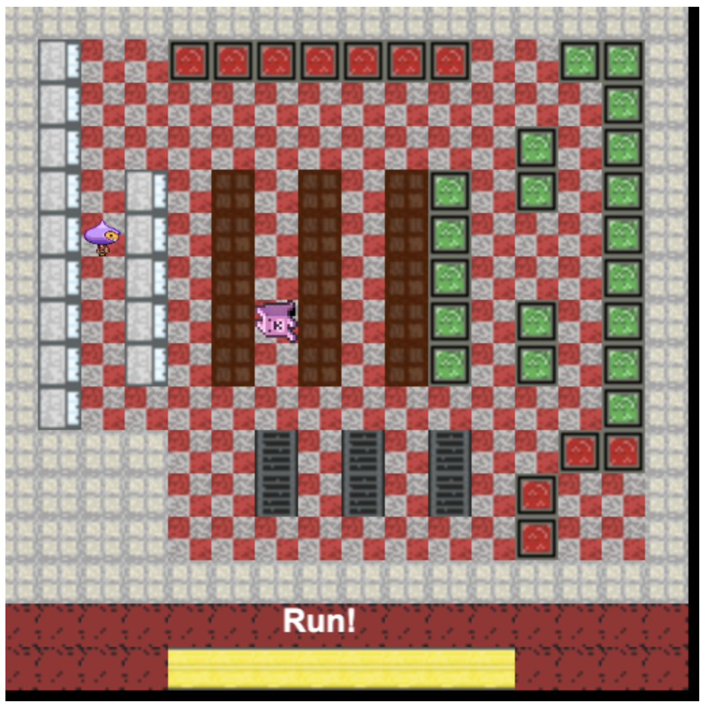

  

# Scary Grocery

    
    
    

A 2D stealth game of wits and reflexes. You're locked in a grocery store overnight and a boogey monster is hunting you. Can you survive until morning?

## Gameplay
The objective of Scary Grocery is to survive for five nights. You must navigate the dark aisles of the store, hiding from a relentless monster. Use the shelves and shadows to your advantage, but be careful—every sound you make could be your last.

## Screenshot

## Features
*   **Stealth Mechanics:** Hide behind shelves and other objects to avoid detection.
*   **Relentless Hunter:** The boogey monster is always searching for you.
*   **Atmospheric Setting:** A spooky, deserted grocery store.
*   **Single Player:** A solo survival horror experience.

## How to Play
*   **W, A, S, D Keys:** Move your character.
*   **Hide:** Use the environment to stay out of sight.

## How to Run

To play, you'll need to run a local web server.

If you have NodeJS, you can run this command in the project directory: `npx http-server`

Then, open your web browser and go to `http://127.0.0.1:8080`.